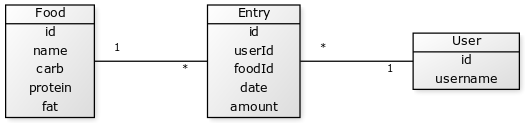
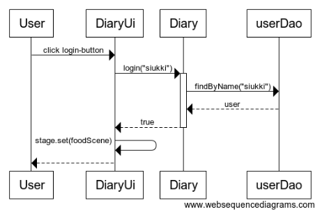

# Architecture

## Application logic

The application uses three classes, which are responsible for the attributes and possible actions of the user, different foods and individual diary entries. These classes and their relationships are described in the image below:

## User Interface

The user interface consists of three windows: the login window, the create new user window and the food list window. If the user enters a non-number value to the fields requiring it, an alert-window will be shown.

## Functionality

When a user has created a valid username and logs in, this is what happens in the application level:

## To be developed further

The ui-class has almost everything needed to create the different scenes a bit unclearly: it could have been divided into clearer parts, even within the class.

Some of the tests could have been more varying: now the test classes contain a lot of repetitive code.

Most errors are not handled in any way: printing the full stack trace to the command line.

There is no user guide.
